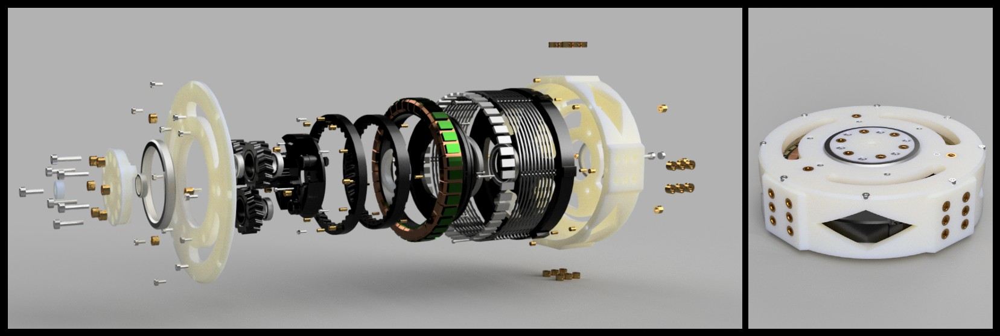
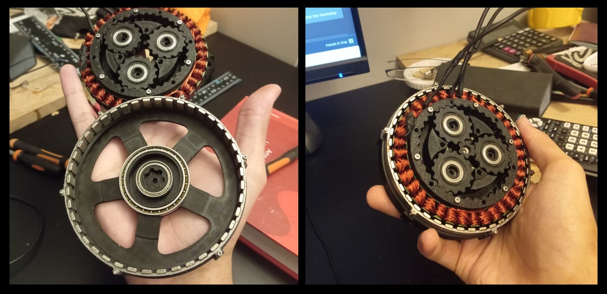

# AN-1-Quadruped (DOCUMENTATION WIP)

(For the reader, i unfortunately did not have the time to extensively document this entire project. I decided to include some of the highlights, the project is far more extensive than this)

Work in progress project that hopes to acheive the highest performing 3D-printed quadruped constructed with the help of ground-up designed high performance 3D printed QDD-actuators.

# Overview

After working on the TTR project (Table Tennis Robot) i gained an interest in more advanced dynamic robotics, espcially quadrupeds. After viewing many different personal quadruped projects mostly based on the MIT mini cheetah, i felt at the time there was truely not a single convincing 3D-Printed quadruped using fully handmade QDD-actuators. The largest compromised seemed always to be around the actuator itself with external motors using some kind of external reduction (belts/capstandrive). After watching a video by mjbots demonstrating their quadruped (quad a1) using machined custom made QDD actuators and seeing the amazing results, i wanted to pursue this but fully 3D-printable and using reasonable available means to construct it. Using my design philosophy that a final product can only ever be as good as its sub-components, i sought to build the best 3D-printed MIT style quadruped by contructing the best 3D-printed QDD actuator.

# The Actuator

Designing, fabricating, testing and evaulating the actuator has been by far the largest amount of time and resources spent on this project. The reason for this comes down to the factors what constitutes a great dynamic actuator joint. For an actuator joint to be viable for dynamic robot application, it needs as good of a balance as possible in mass, size, backdriveability, tolerance, torque and controllability. Sacrifice any of these factors, you will reach an unideal result and thus an unideal robot. It was then my priorirty from the start to design an actuator incorporating as much of these aspects as possible in a balanced way. Instead of reinventing the wheel i looked at practical working examples, the best of which being the MIT mini cheetah quadruped actuators. The actuator design and idea was fairly public knowledge at this point, but the biggest takeaway for me was the concept of having a flat pancake style BLDC motor with an internal low gear ratio gearbox inside the stator. Very early on i came to a working base concept.

## Early Concept (Generation 1)

https://github.com/user-attachments/assets/92d0cb23-9992-41e9-826b-c3d4a40cceba

## Generation 2

## Generation 3
261 components, 18N.m/25A, 580g, 35mm thick, highest performance 3D printed actuator of its class. Extremely unique combination of cycloidal and planetary gearbox systems. Planetary gears with cycloidal gear profiles custom generated with software recently developed by Eelco Hoogendoorn. Allows never seen before high performing fully 3D printed QDD gearboxes. Printed with PPA-CF Core composite filament. PPA-CF with the CF in the core allows the outside to have a nice slick very low contact friction nylon giving the best of two worlds. A nylon outer surface ideal in a gearbox while a high density carbon fibre interior leading to extremely high stregth and dimensional accuracy leading to virtually zero backlash.

# Leg Design

# Leg Test
Using inferior generation 2 actuators, still impressive results,
<table>
  <tr>
    <td width="50%">
      <video src="https://github.com/user-attachments/assets/a475ff6d-866b-4999-ba24-7cd93b9f1a67" controls></video>
    </td>
    <td width="50%">
      <video src="https://github.com/user-attachments/assets/7c7bdfbb-6700-4f75-baf9-b928117ba0bc" controls></video>
    </td>
  </tr>
</table>

# Self designed FOC controller

I decided to have a hand on designing my own FOC controller able to power and effectively and accurately control my actuators. Below is the schematic i made myself in KiCad.

# Chassie Design & Build

